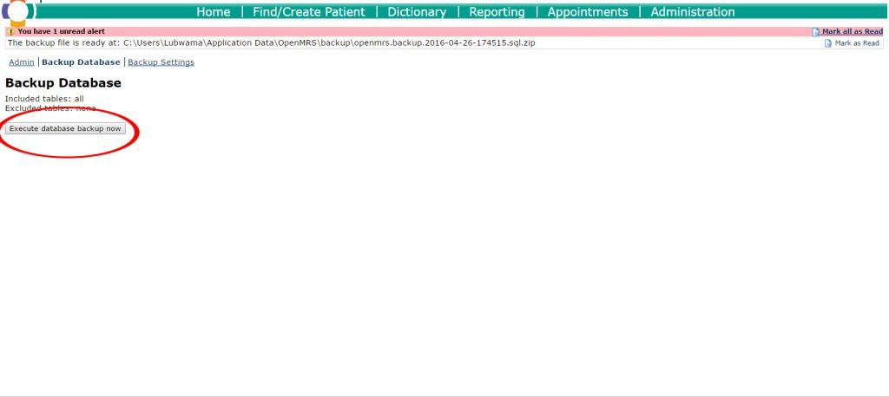

# Backup and Restoration 
## Database Backup
### Database Backup Module 
UgandaEMR includes a backup module that can be run from the administration interface. 

The Backups are stored in the OpenMRS configuration directory
The two common paths to find the backups are
1. C:\Users\{UserAccount}\Application Data\OpenMRS\backup
2. C:\Application Data\OpenMRS\backup

The steps in the backup are.
1. On the Dash Board Click on the Backup Database icon.

2. Click on the Execute database backup now

3. The backup begins and the progress is shown until completion.

4. Once the backup is complete, a message is displayed with the status.

### Using HeidiSQL

### MySQL Dump
The native mysqldump tool can also be used to dump a database into a file 
`mysqldump -u [useraccount] -p --opt --routines openmrs > backupDDMMYY-HHMM.sql`
* [useraccount] - the username for accessing the database
* backupDDMMYY-HHMM.sql - the name of the file, recommended naming for example is backup04April16-1425.sql which has a date and time when the backup was done

**NOTE** The password will be prompted for on the command line

## Database Restore 
### Using HeidiSQL 
The UgandaEMR installer includes HeidiSQL a tool that allows the restoration of backup files into the backend database.
 
### Using mysql command line 
The native mysql client tool can also be used to load a database from a file 

`mysql -u [useraccount] -p openmrs < [backup_file]`

* [useraccount] - the username for accessing the database
* [backup_file] - the path to the backup file 

**NOTE** The password will be prompted for on the command line
