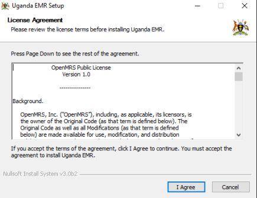
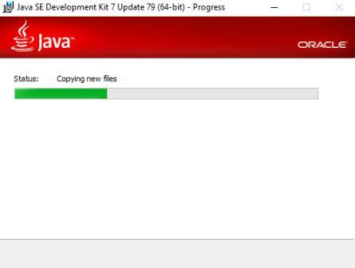
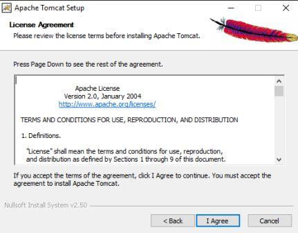
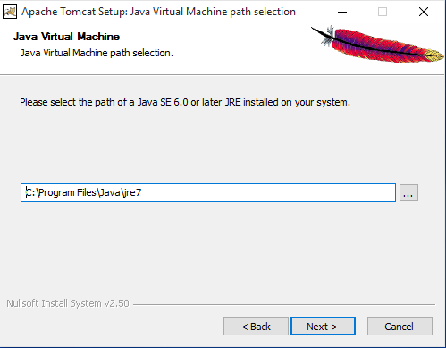
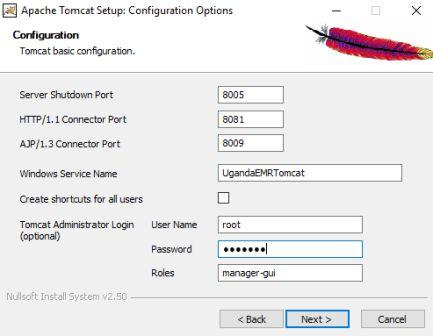
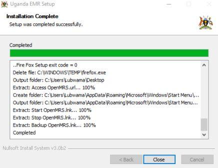

# Installation
## Pre-requisites
### Minimum Computer Requirements

1. Windows 7 (both 32-bit and 64-bit versions supported)
2. 4GB of RAM
3. 1.5GHz duo core processor

### Minimum Software Requirements
1. Java 7
2. Tomcat 7
3. MySQL 5.5
4. Mozilla Firefox 44

## Manual Installation
### Requirments for Manal Installation
This process will be added at a later stage, as currently the automatic installation is the easiest way to get the required configuration

## New Installation - Using the installer
The installer provides all the pre-requisite components for setting up UgandaEMR, parts of this guide have been adopted from the World Health Organization (WHO) OpenMRS Express guide.

There are separate installation files for 32-bit and 64-bit Windows systems so pick the installation package.

### Installation Directories and Menu Items
The installer creates the following directory structure:

* **Main Directory** - C:\Program Files\UgandaEMR
* **Tomcat Directory** - C:\Program Files\UgandaEMR\UgandaEMRTomcat
* **Mysql Directory** - C:\Program Files\MySQL\MySQL Server 5.5 *TODO: Correct this*
* **OpenMRS Configuration Files** - C:\ApplicationData\OpenMRS *TODO: Correct this*

The following items are also added to the Windows Start Menu:
* **TODO: Add Start Menu Items**

A shortcut link to the UgandaEMR instance is also added to the Desktop **TODO: Add screenshot of desktop with the Shortcut link**

### Installation Overview

### Installation Steps
1. Launch of the splash screen

2. Agreement of installation

3. Selecting components to install.

4. Determining Installation directory.

5. Determine Shortcut directory

**Required Software**

6. Install Java

7. Install Mysql

8. Install Tomcat.

9. Install Firefox

**Completion **

10. Complete Installation

### Post-installation Configuration

11. Start Application.

This installation guide is pictorial.

Step 1 Check the Computer Operating System Bit

Step 2 Launch the installer either 32 bit or 64 bit, depending on the computer bit.

Step 3 Agree to the terms and conditions in the installer

Step 4 Select components to install

Step 5 Select default directory in which openmrs will install. NB. Leave the current/default preselected option.
