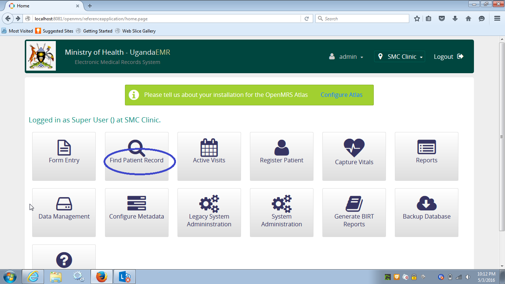

## Patient Registration and Management

### Patient Registration

1.Login and on the home page click the Register patient link circled below

2.Enter the details of the patient ensuring that the required fields which are marked with \* are entered

3.On clicking the Register Patient icon, you enter patient details as below;

3.1._Patient Name_
3.2._Gender_ 
3.3._Birth date_ 
 3.4._Marital Status_
 3.5._Birth Location_ aka village in which patient was born
 3.6.\*Address: Where the patient lives. Please follow the same procedure as above

3.7._Phone Number: \_\__\_\__\_\_
3.8.\_ Next of Kin: 

3.9.\* Confirm: Shows all the bio-data collected about the patient.
3.10. Saving The data: Click confirm to save, if not click cancel to edit. You should see a patient dashboard once saving is successful as below 

### Merging Patients

Patient Merging in UgandaEMR refers to the act of “retiring” Patient B in favour of patient A. In such an event, the visits, encounters, observations and other underlying objects which belonged to patient B will be transferred to Patient A, and Patient B will be retired. In a multiple patient merge process, Patients A, B and C may be retired in favour of patient X. Patient Merging is useful in situations where duplicate records have been created for a single patient.

**Note:** Patient merging is uni-directional only. It does not allow the restoration of merged data i.e. you cannot reverse the process. Therefore patient merging shouldn’t be taken lightly and effected only if you are **100%** sure that the patients are the same.

To merge patients;

1. Login as a user with administrator privileges and click the “_Legacy System Administration_” link as shown in the image below.
  

2. Click on the _“Find Patients to Merge_” link as shown below.

  

1. Select a minimum of two patient attributes to search on and click _“search”_ as shown in the image below.

  

2. This displays a list of patients who match the attirbutes used in the search. Select two or more patients to continue.

  

3. Select your preferred patient to keep and click _“Merge Patients”_ button to continue

  
  The "Preferred Patient" is the patient who "survives" in favour of the retired patient.

4. A Dialog box displays asking you to confirm the Merge. Click “Ok” to confirm and complete the patient merging process or "Cancel" to abort the process.

  You should see a notification indicating that the process was completed successfully.

  

### Marking Patients as Dead

To mark patient as dead, you will have to log into one of the clinics, i.e. SMC, ART, TB, MCH, OPD, Lab.

An example is; SMC;  login at the "SMC clinic" session, as shown below.  

A screen will open as shown below. Select the "Find Patient Record" option.  

On the screen that appears, type the name or ID of the patient, as registered in the system.  

Search for and find the client - Demo 123  

### Marking a Dead Patient as alive

TBD

### Common Errors

#### User is not a provider

##### Solution

The above means your User Account does not have privileges to provide care to a patient. You therefore have to add Provider role to the user account as [indicated herein](making_an_existing_user_a_provider.md)

#### Failed to save changes during patient registration 

##### Solution

This problem is common with implementations that have been upgraded from 1.6.3 and is caused by null or empty string values for patient attributes during migrations. 

The solution is as follows:
1. Backup your database 
2. Run the following command:

`DELETE FROM person_attribute WHERE value IS NULL OR value = '';`
