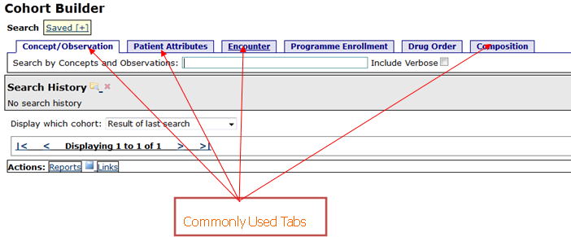
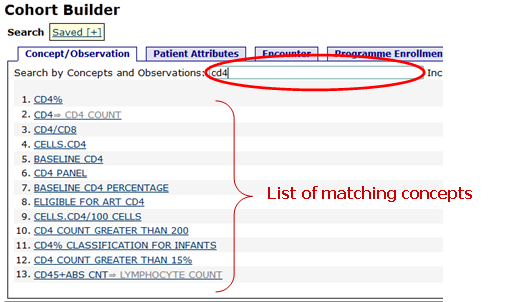
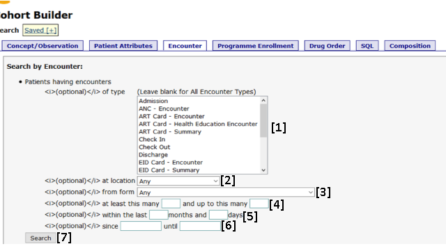

## Cohort Builder 
**What is a cohort?**

* In statistics and demography, a cohort is a group of subjects who have shared a particular experience during a particular time span (e.g. people born in Uganda between 1980 and 1999, truck drivers between age 30 and 40 who smoke, Patients Started on ART in a given Month). 

* Cohorts may be tracked over extended periods of time in a cohort study.

* Cohort (builder),  is an OpenMRS capability that provides a group of proximate data, and/or operations  and produce  an aggregation of individuals
 who experience the same event within the same time interval  

**Why use cohort builder?**

* The cohort builder is a strong tool in OpenMRS which is used answer and create Ad-hoc reports i.e. number of patients seen last week in your clinic and are between the age of 0- 24  

**How to access the cohort builder:**

* Step 1: Click on the Cohort Builder link on the top level form. This will show you the Cohort Builder page as shown below.

**How to query OpenMRS database based on either the concept ID or concept name:**

This section enables the user to search for concepts or observations existing in the system.

Step 1: **Click on the Cohort Builder** link on the top level form.  This will show you the **Cohort Builder** page as shown below.

Step 2: Click on the **Concept/Observation** tab to show the page to be used in searching. 

Step 3: Type in the concept name or ID of the variable you are looking for. E.g.Cd4

Step 4: In case you typed in the concept name, click on the one that matches what you desire otherwise click on the only matching entry displayed.

The above action will show you a page with further settings/options for the chosen concept as shown and explained below:

**1** Allows you to query for the variable using the following options:
* **Any:** will return all matching entries,
* **None:** will return those patients without this valuable entered on them.
* **Earliest** will return the first variable to be entered. 
* **Most Recent:** will return the most recent variable entered.
* **Lowest:** will return the lowest value for this variable.
* **Highest:** will return the highest value for this variable.
* **Average** turns the average value from with the eligible results.

**2.** is optional and adds conditional options to filter the results this includes <, >, <=,>= i.e. less than, greater than, less or equal to or greater or equal to the value specified in the right hand box.

**3.** Is optional and adds another filter based on months or days 

**4**. is optional and adds another filter for based on date ranges

**5.** Is the link to commences the query process

**6.** Is the link to cancel the query process.

**How to query OpenMRS database based on patient demographic attributes:**

This is mainly used for querying the OpenMRS database for patient based on their demographic attributes.

Step 1: Click on the **Cohort Builder** link on the top level form.  This will show you the **Cohort Builder page** as shown below.

Step 2: Click on the **Patient Attributes tab** to show the page to be used in searching.

 
 This will display the Search by Demographics page as shown below
 
 The following are the options available
1. **Gender** allows you to select and search by gender i. e Male or Female
2. **Age** allows you to filer between ages i.e. 0-14
3. **Birthdate** allows you to filer between birth dates 
4. **Alive only** allows you to search for alive patients
5. ** Dead only** allows you to search for dead patients 
6. ** Search **is the tab or button for the search
 
Step 3: Click on the Search button to show the number of patient that match the criteria you specified.

**How to query OpenMRS database based on encounter information:**

This is mainly used for querying the OpenMRS database for encounter or visit related scenarios.

Step 1: Click on the **Cohort Builder** link on the top level form.  This will show you the **Cohort Builder page** as shown below.
Step 2: Click on the **Encounter tab** to show the page to be used in searching.

 This will display the Search by Encounter page as shown below
 
 **1.** Encounter type: Allows you to select and search by encounter i.e. summary page 
 
** 2.** Location: Optional but allows you to select and search by a given location if you have multiple locations in the system

** 3.** From Form: Optional but allows you to select and search basing on a given form 

 **4.** At least this many _____ and up to this many____: allows you to search by a given number of encounters for a given patient [for example finding the number of patients with at least 4 encounters but not more than 20 ]
 
** 5.** within the last _____ months and ____days: optional but allows you to search by number of month and number of days:

 **6.** since ___________until ____________: optional but allows you to search by date ranges
 
 **7.** Search is the tab or button for the search 

**Step 3:** Click on the Search button to show the number of encounters that match the criteria you specified.

**How to query OpenMRS database using Program Enrollment Information:**

This is mainly used for searching/quering data by Program Enrollment and Status

Step 1: Click on the **Cohort Builder** link on the top level form.  This will show you the Cohort Builder page as shown below.

Step 2: Click on the Programme Enrollment tab to show the page to be used in searching.

Step 3: Click on the drop down next to **Program** label and select the desired program.

Step 4: Optionally, choose the date range for when the query should be applied.

Step 5: Click on the **Search** button to show the number of patient that match the specified programme enrollment criteria.

**How to query OpenMRS database using Drug order Information**

OPENMRS DOES NOT CURRENTLY SUPPORT DRUG ORDERS.

**How to query OpenMRS database using SQL Tab **

*this section will be updated latte*r 

