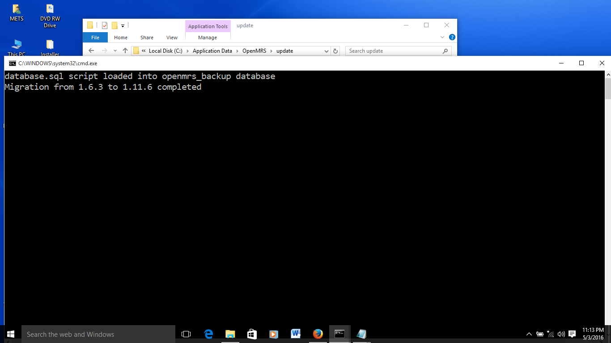
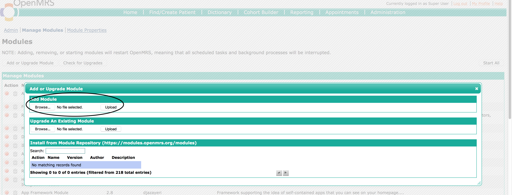

## Upgrading UgandaEMR 

### Upgrading from OpenMRS 1.6.x,1.9.x
The upgrade from 1.6.x,1.9.x to 1.11.6 involves running two steps:

1. Creating a backup file of the existing 1.6.3 installation 
2. Migrating the 1.6.x,1.9.x database backup file 

All these steps are run from the upgrade folder which can be found at C:\Application Data\OpenMRS\upgrade like in the image below 

Due to the security restrictions, the files shall need to be run as administrator 
#### 1.6.x,1.9.x installed on same machine as 1.11.6 
In this scenario the 1.6.x database is running on the same computer as the new 1.11.6 database.
NB for 1.9.x first run the backup script before installing UgandaEMR. 

1. Double click the backupdatabase file, and the window below will appear. 

2. Close the window to show the file manager, and a new file database (or database.sql) will be shown.

3. This file should have a size greater than 0 sKB, which shows that the backup process was successful.
4. Double click on the updatedatabase_1_6_x.bat or updatedatabase_1_9_x.bat depending on which version of OpenMRSyou are migrating from, and wait for some time as a black window is displayed.   

#### Database backup script available 
The backup file exists from another computer and is to be added to the upgrade folder

1. Copy the backup file to the upgrade folder
2. Rename the backup file to database (or datatabase.sql if the file extension is shown)
3. Double click the upgraded database file, and wait for some time as a black window is displayed.   

### Adding a new module
A new module is usually added to provide new functionality and features that were not currently available. 
1. Login as a user with administration privileges
2. Click legacy administration link as circled in the image below

3. Select the Manage Modules link 

4. On the Manage modules page, click the Add/Upgrade module button

5. In the popup window use the browse button under Upgrade Existing module to select the module file from your computer, then click Upload

6. The module will be uploaded and started, which is seen by having a red button next to the name of the module 

### Upgrading a module
In this case the modules to be upgraded will be uploaded through the administration interface
1. Login as a user with administration privileges
2. Click legacy administration link as circled in the image below

3. Select the Manage Modules link 

4. On the Manage modules page, click the Add/Upgrade module button

5. In the popup window use the browse button under Upgrade Existing module to select the module file from your computer, then click Upload

6. The module will be uploaded and started, which is seen by having a red button next to the name of the module 

### Upgrading with a WAR file 
This will be done when there are multiple modules that need to be upgraded as a complete package, therefore a new WAR file is to be installed

1. Backup UgandaEMR
2. Stop Tomcat 
2. Clean up the existing installation by: 
  * Delete the following from the C:\Program Files\UgandaEMR\UgandaEMRTomcat\webapps folder:
    * openmrs.war 
    * openmrs folder   
  * Delete all the modules in the directory C:\Application Data\OpenMRS\modules which is where any modules uploaded from the administration interface are stored. The modules in this directory override those added to the WAR file 
  * Delete the C:\Application Data\OpenMRS\lucene folder as these indexes have to be rebuilt 
3. Copy the new WAR file to C:\Program Files\UgandaEMR\UgandaEMRTomcat\webapps
4. If needed run any upgrade SQL scripts  
4. Start Tomcat  
3. Go to the UgandaEMR login link at http://localhost:8081/openmrs/ 

### Common Troubleshooting Tips
#### backupdatabase script has an access denied error

This is because the password for root has changed from a blank password

1.Open the backup database (or backupdatabase.bat) file in Notepad and add the following to the line that starts with @mysqldump

`@mysqldump -ppassword`

password is the password of the root account, and there is no space after the -p

2.Doubleclick the backupdatabase file

#### upgradedatabase script has an error - openmrs_backup database not found
This is because the installer did not create the openmrs_backup database. Uninstall UgandaEMR and start again

#### upgradedatabase script error 2003 - Can't connect to MySQL server on local host (10061)

This is because the password for root has changed from a blank password

1.Open the upgradedatabase (or upgradedatabase.bat) file in Notepad and add the following to the line that starts with @mysqldump

`@mysql -ppassword`
password is the password of the root account, and there is no space after the -p

2.Doubleclick the upgradedatabase file

#### Upgrade failed so need to reset environment 

In case your upgrade fails, there is a need to restore the environment so that you can try again. 

The steps are as follows:

1. Backup the openmrs database 
2. Delete the openmrs and openmrs_backup databases
2. Create a new openmrs and openmrs_backup databases
3. On the openmrs database run the following scripts:
  * new-install.sql - this one creates a blank database for UgandaEMR 
  * concept_dictionary script - use the latest version  

4. Restart your computer so that UgandaEMR can start
5. Run the upgrade again 

#### Error starting uploaded module

This is usually characterized by a green arrow next to the module name, an error message at the top of the Manage Modules page and a text box in the row of the module name with the words "Error starting! Click here for details"

1.Click the text box to find out the details of why the module did not start:
* If the error is caused by a missing module then upload the module following the steps above
* If the error is caused by a higher version of a module, then upgrade the module to that higher version. Please note that this may cause additional errors in other modules that may be incompatible with the higher version.
* If a lower version of a module is required, then you may need to upload a lower version of the module, though this may cause other modules to fail loading

2.Restart the computer which resets all UgandaEMR services.

#### UI Framework Error: Null Pointer Exception on Patient Registration
A common cause is blank entries in the address hierarchy during the upgrade process as seen in the link below 

1. Click the Administration link in the top menu as below:

2. Click the Manage Address Hierarchy link on the administration dashboard

3. Delete all the address hierarchy entries in the rectangle which are causing the error one level at a time 

#### Error starting Data Integrity Module 
This error tends to happen from UgandaEMR 1.0.16 that requires this module to be available, which is based on upgrades from old versions of OpenMRS that had the data integrity module installed. The old version of a module left a dataintegrity_rule table installed, so the new version cannot replace this table. 

The fix involves deleting the dataintegrity_rule table using different tools:

1. Command line 
  * Connect to the database using the command 
  
  `mysql -u openmrs -p` which will request for a password 
  * Change to the openmrs database 
  
  `use openmrs`
  * Delete the dataintegrity_rule table 
  
  `DROP TABLE dataintegrity_rule`
  * Restart your computer 
  
2. Heidi SQL 